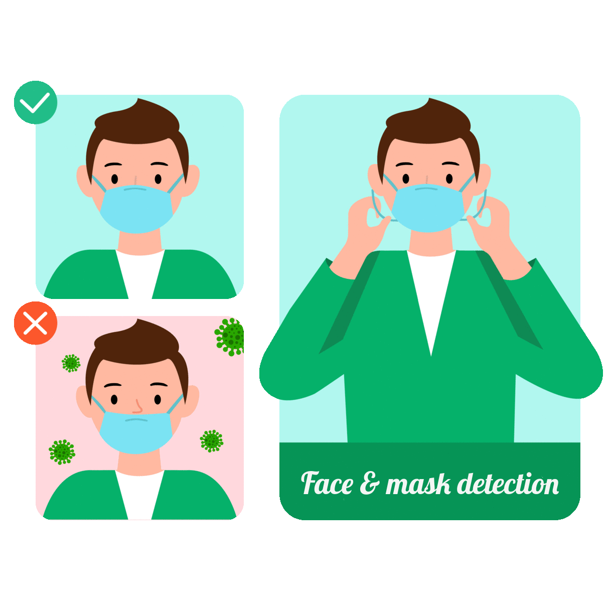

# Mask detection using Deep Learning 💵💳

<p align="center">
  
</p>

## 📌 Introduction

This Object Detection Web Application uses a several features of images to predict the whether a person or group of persons wears a mask or not with SSD on the top of the TensorFlow2 framework.This Dataset is taken from UCI Repository and also available in Kaggle,Data were extracted from images that were taken from genuine and forged specimens,***In this ml model we are considering 0 for mask wearing and 1 for not wearing.***

## 🎯 Purpose of the Project

Since the spread of the Covid-19 virus has become an emerging health problem all around the world, to slow down its devastating effects on societies and economies, World Health Organization (WHO) has imposed many guidelines. These guidelines include wearing face masks, maintaining social distancing, adopting of virtual work culture, and many more. Among all these guidelines, face mask detection is one of the innovative technology which can help in identifying the number of people wearing a face mask, regulating proper social distancing, and preventing a huge mass from the severity of the infection. The facemask detection technology is operated with the use of different programming languages and software such as Python, Deep-Learning, Tensor Flow, Keras, OpenCV, and many more

### What are the Use Cases of the Face Mask Detection System 💵?
These face mask detection systems are broadly used in the crowded sector to protect the millennials from the deadly infection of the coronavirus. Out of many, some of the major areas where this system is broadly used, are listed below:

**Airports**- With the rise of the Covd-19 pandemic, the use of a face mask detection system is quite needed because this is the place where chances of the spread of the virus are high. The facemask detection system captures the face of the traveler at the entrance, then inside the airport, if a traveler is found without a mask, then the picture of that particular individual is sent to the airport authorities to take immediate action.

**Offices and Organizations**- As some organizations are unable to transform their work culture virtually, for those organizations, to maintain the safety standards at the workplace, face mask detection systems are used. The system helps employees to get the remainder of wearing masks and further helps the organization to maintain a safe work environment in the office premises for employees.

**Hospitals**- These face mask detection systems are useful inside the hospitals to monitor whether the staff is properly wearing their masks inside the campus during their shifts. Further, these face mask detection systems can send a reminder to the quarantine people who need to wear a mask. This sends an alert to the people to take care of themselves.

## 🏁 Technology Stack


* [TensorFlow](https://www.tensorflow.org/)
* [Flask](https://github.com/pallets/flask)
* [Docker](https://www.docker.com/)

## 🏃‍♂️ Local Installation

1. Drop a ⭐ on the Github Repository. 
2. Clone the Repo by going to your local Git Client and pushing in the command: 

```sh
https://github.com/GopalakrishnanSubramani/mask_detection_tf2.git
```
3. Install the Packages: 
```sh
pip install -r requirements.txt
```
You need to install flask seperatly with a latest version to run the flask app in Postman.

## Dockerize your Application

<p align="center">
  
</p>

1.Create a **Dockerfile** to create a Docker Image.

```sh
FROM python:3.9-buster
RUN mkdir -p /app
COPY . /app
EXPOSE 8000
WORKDIR app
RUN apt-get update
RUN apt-get install ffmpeg libsm6 libxext6  -y
RUN pip3 install -r requirements.txt
CMD ["python3","app.py", "--host", "0.0.0.0", "--port", "5000"]

```

2.Build the Docker Image

`docker build -t {Name_of_your_Image}`

3.Run your Docker Image

`docker run -p 5000:5000 gkmask`

**Note**: gkmask is a docker image name, you can name it anything!!

Now your Docker Container is running at ` http://127.0.0.1:5000`

## 📋 Further Changes to be Done

- [ ] Deploying the Web Application on Cloud.
     - [ ] AWS BeanStalk
     - [ ] Google Cloud Platform
     - [ ] Azure
     
## 📜 LICENSE

[MIT](https://github.com/DARK-art108/Bank-Note-Authentication-End-to-End-Project-1/blob/master/LICENSE)
    
